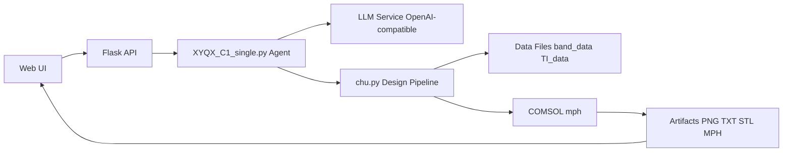

# XYQX-C1

AI-driven acoustic metamaterial inverse design platform for AVHI (Acoustic Valley Hall Insulator), with chat interaction, automated geometry generation, and COMSOL simulation export.


## Key Features

- Conversational AVHI design (LLM intent parsing + design trigger)
- Multi-user web sessions with isolated history
- COMSOL-based simulation workflow with exported artifacts
- Ready-to-download outputs: PNG, TXT, STL, MPH

## Architecture



## Quick Start

```bash
pip install -r requirements.txt
python XYQX_C1_single.py
```

Open http://localhost:5000

## Main Endpoints

- POST /api/design
- POST /api/chat
- POST /api/reset
- GET /api/stats
- GET /api/download/<filename>

> Due to GitHub's storage limitations, the fine-tuned AVHI structural design large language model cannot be uploaded. To use the full version of the design function, please visit the following URL:
> https://xyqx-c1.cpolar.io/

## Repository Notes

- Default local inference endpoint: http://127.0.0.1:8000/v1
- API key is loaded from .env.sample (OPENAI_API_KEY)
- This repository currently has no declared open-source license
